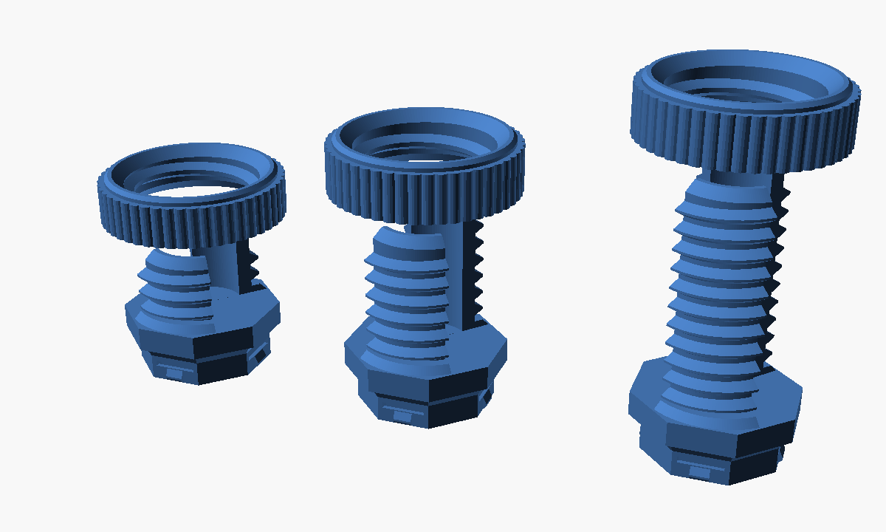
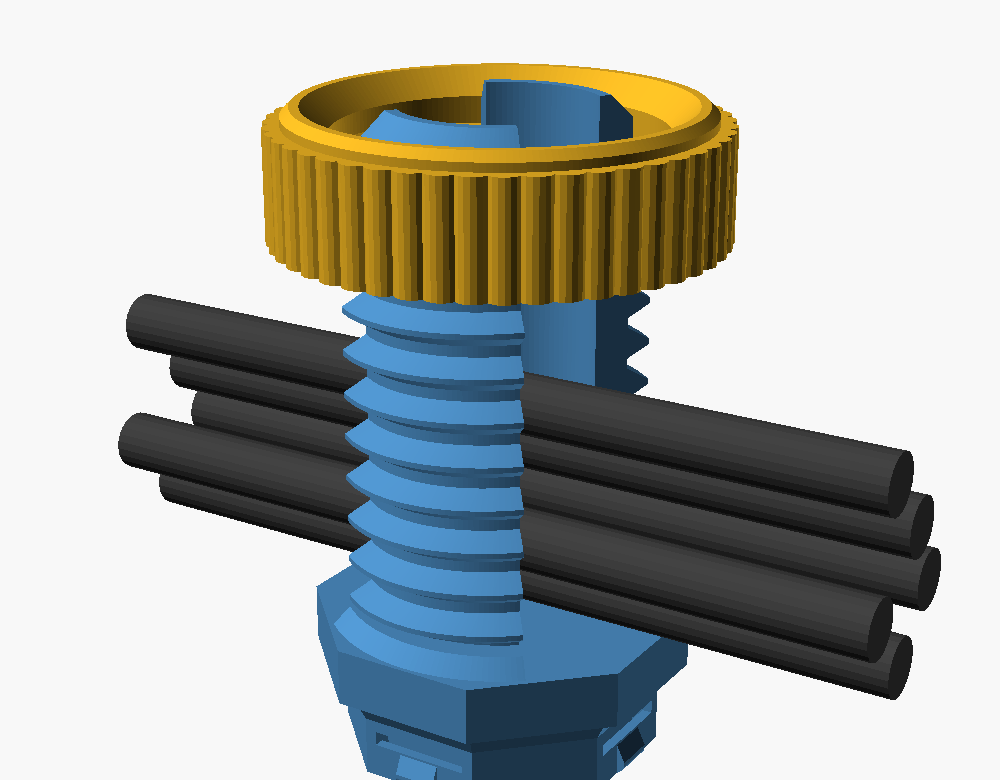

# Under-Desk Cable Tie für Multiboard

Kabelhalter zum Einschnappen ins Multiboard-Multihole — funktionale Nachbildung von
[Under-Desk Cable Tie for OpenGrid System](https://makerworld.com/en/models/1908305-under-desk-cable-tie-for-opengrid-system),
bei der der OpenGrid-Fuß durch einen Multiboard-Snap ersetzt ist.





## Funktion

Gewindetopf mit zwei gegenüberliegenden Fenstern (je 100°): die Kabel laufen
mittig geradeaus durch den Topf und auf der anderen Seite wieder raus. Rändelmutter
von oben über die Kabel herunterschrauben — der Mutternring sperrt beide Fenster,
die Kabel können nicht mehr raus.

Mehrere Kabel stapeln sich übereinander im Topf. Deshalb unterscheiden sich die
Größen vor allem in der **Höhe**, nicht im Durchmesser — genau wie beim Original.

Alle drei brauchen nur **eine** Multiboard-Zelle.

| Größe | Kabel | Posthöhe | Grundplatte | Snaps |
|---|---|---|---|---|
| S | 1–2 | 12 mm | 1 Zelle (25 × 25 mm) | 1 |
| M | ~5 | 22 mm | 1 Zelle (25 × 25 mm) | 1 |
| L | bis ~10 | 36 mm | 1 Zelle (25 × 25 mm) | 1 |

Gleich bei allen: Gewinde-Ø 22 mm, Innen-Ø 14,0 mm, nutzbare Kanalbreite 10,7 mm,
Steigung 3 mm, radiales Spiel Mutter/Gewinde 0,3 mm, Wandstärke unter dem
Gewindegrund 2,4 mm, Hohlkehle am Postfuß 1,2 mm.

Der Gewinde-Ø ist durch die 25-mm-Zelle begrenzt: die Grundplatte folgt der
Multiboard-Zellenkontur (Achteck, 25 mm Schlüsselweite, 7,32 mm Eckfase), damit das
Teil wie übliche Multiboard-Teile sauber auf dem Raster sitzt.

## Drucken

STLs liegen fertig in `stl/`. Alle Teile drucken ohne Support:

- **Body**: Snap nach unten auf das Bett, Gewindepost nach oben
- **Mutter**: flach, Gewinde selbsttragend
- 0,16 mm Layer (0,12 mm für saubereres Gewinde), 3 Wände, 20–25 % Infill
- PLA oder PETG

Sitzt die Mutter zu stramm, `thread_slop` erhöhen (Default 0,15) und neu rendern.

## Montage

Snap ins Multihole drücken und ca. 1/8 Umdrehung drehen, bis die vier Bumpouts im
Boardgewinde greifen. Achteckig ⇒ 8 Ausrichtungen in 45°-Schritten.

## Selbst rendern

Braucht [OpenSCAD](https://openscad.org) und [BOSL2](https://github.com/BelfrySCAD/BOSL2)
in `~/Documents/OpenSCAD/libraries/`.

```sh
./build.sh
```

Parameter in `src/cable_tie.scad`: `size` (S/M/L), `part` (all/body/nut),
`slot_a` (Fensterwinkel), `thread_d`, `thread_slop`.

## Passform

Die Snap-Geometrie wurde gegen eine aus den offiziellen Multiboard-Maßen generierte
Board-Zelle geprüft: ausschließlich die vier Bumpouts greifen ins Boardgewinde
(0,87 mm³ Überdeckung), sonst kollisionsfrei.

## Credits & Lizenz

Die Snap-Geometrie (`src/multiboard_snap.scad`, daraus gerendert
`src/multiboard_snap.stl`) stammt aus
[MultiConnectOpenSCAD](https://github.com/cschneid/MultiConnectOpenSCAD) von
Andy Levesque, mit Credit an @David D (Multiconnect) und Jonathan / Keep Making
(Multiboard).

Das gesamte Projekt steht deshalb unter
[CC BY-NC-SA 4.0](https://creativecommons.org/licenses/by-nc-sa/4.0/) **und** der
[Multiboard License](https://multibuild.io/license); es gilt jeweils die strengere
Regel. Volltext und Attribution in [`LICENSE`](LICENSE). Kurz:

- Für den Eigenbedarf drucken und nutzen: erlaubt.
- Remixe teilen: erlaubt, unter denselben Bedingungen und mit Namensnennung.
- Kommerzielle Nutzung, auch der Verkauf von Drucken: **nicht** erlaubt.

Kein offizielles Multiboard-Teil; nicht mit MULTIBOARD LTD verbunden oder von
ihnen unterstützt.

Hinweis: `multiboard_snap.scad` braucht eine BOSL2-Version von vor 2024-08
(`spin` als Vektor). Deshalb liegt die daraus gerenderte Geometrie als STL bei;
`src/cable_tie.scad` importiert das STL und läuft mit aktuellem BOSL2.

Die Idee des Mechanismus stammt vom oben verlinkten OpenGrid-Modell; die Geometrie
hier ist eigenständig konstruiert.
